# Simulasi Cloud Task Scheduling Menggunakan Algoritma Heuristik Sufferage

[](https://www.oracle.com/java/)
[](https://maven.apache.org/)
[](https://cloudsimplus.org/)
[](#)

Implementasi optimasi task scheduling pada infrastruktur cloud computing (*multi-datacenter*) menggunakan **Algoritma Heuristik Sufferage** berbasis **CloudSim Plus**, dibandingkan dengan **Round Robin** sebagai baseline.

---

## 👥 Anggota Kelompok 7

| No | Nama Anggota | NRP |
|:--:|:---|:---|
| 1 | Imam Mahmud Dalil Fauzan | 5027241100 |
| 2 | Ahmad Yazid Arifuddin | 5027241040 |
| 3 | Christiano Ronaldo Silalahi | 5027241025 |
| 4 | Oscaryavat Viryavan | 5027241053 |
| 5 | Adiwidya Budi Pratama | 5027241012 |

---

## 📌 Ringkasan Proyek

Task scheduling merupakan salah satu tantangan pada lingkungan cloud computing. Kompleksitas bertambah ketika infrastruktur terdistribusi dan beragam, di mana setiap node komputasi punya kapasitas CPU (MIPS), core, memori, dan bandwidth yang berbeda-beda.

Algoritma konvensional seperti Round Robin atau First-Come First-Served rentan menyebabkan:
1. **Makespan yang tinggi**: waktu penyelesaian keseluruhan menjadi lama karena tugas besar dialokasikan ke mesin berkapasitas rendah.
2. **Ketidakseimbangan beban (Imbalance)**: sebagian mesin *overload*, sedangkan mesin lain *idle*.

Di proyek ini diimplementasikan algoritma **Sufferage Heuristic** (pondasi pendekatan *Load Balanced Min-Min / LBMM*). Algoritma ini memprioritaskan task berdasarkan nilai *sufferage* (selisih waktu penyelesaian terbaik pertama dan kedua) untuk menekan *Makespan*.

> **Temuan awal:** Sufferage memangkas makespan secara signifikan dan menaikkan utilisasi resource dibanding Round Robin, tetapi *Degree of Imbalance*-nya justru lebih tinggi karena task cenderung menumpuk di VM yang cepat. Temuan ini menjadi motivasi untuk metaheuristik multi-objektif pada roadmap.

---

## 🎯 Objektif & Metrik Evaluasi

Simulasi mengukur efektivitas penjadwalan berdasarkan 5 metrik utama (ditambah waktu scheduling sebagai metrik pendukung):

### 1. Makespan
Total waktu yang dibutuhkan untuk menyelesaikan seluruh cloudlet. Semakin kecil, semakin baik.
$$\text{Makespan} = \max_{j \in \text{Cloudlets}} (FT_j)$$
Di mana *FTj* adalah waktu selesai (*finish time*) cloudlet $j$.

### 2. Degree of Imbalance (DI)
Tingkat ketidakseimbangan beban kerja antar VM. Semakin kecil, semakin merata.
$$DI = \frac{T_{max} - T_{min}}{T_{avg}}$$
Di mana *Tmax*, *Tmin*, *Tavg* berturut-turut adalah beban waktu eksekusi VM maksimum, minimum, dan rata-rata.

### 3. Resource Utilization (RU)
Persentase rata-rata pemanfaatan kapasitas komputasi VM. Semakin tinggi, semakin baik.
$$RU = \frac{\sum_i \text{BebanWaktuCPU}_i}{\left(\sum_i \text{PE}_i\right) \times \text{Makespan}} \times 100\%$$
`BebanWaktuCPU` adalah total durasi eksekusi cloudlet pada VM dan `PE` adalah jumlah core virtual VM. Penyebut memakai total PE karena satu VM dapat menjalankan beberapa cloudlet paralel pada beberapa PE.

### 4. Throughput
Jumlah tugas yang selesai per detik. Semakin tinggi, semakin baik.
$$\text{Throughput} = \frac{N}{\text{Makespan}}$$
Di mana *N* adalah total cloudlet yang diselesaikan.

### 5. Average Response Time (ART)
Rata-rata waktu dari task di-submit hingga selesai. Semakin kecil, semakin baik.
$$\text{ART} = \frac{1}{N} \sum_{j=1}^{N} (FT_j - SubmitTime_j)$$
Seluruh cloudlet di-submit bersamaan pada t = 0 (*submission delay* = 0), sehingga nilai ART setara dengan rata-rata *finish time*.

### 6. Waktu Scheduling (`sched_ms`)
Waktu wall-clock yang dipakai algoritma untuk menghasilkan penjadwalan (milidetik). Ini bukan metrik kualitas jadwal, melainkan biaya komputasi algoritma, dan satu-satunya kolom yang bervariasi antar run pada algoritma deterministik.

---

## 🏗️ Arsitektur Simulasi

Simulasi merepresentasikan lingkungan *multi-cloud datacenter*:

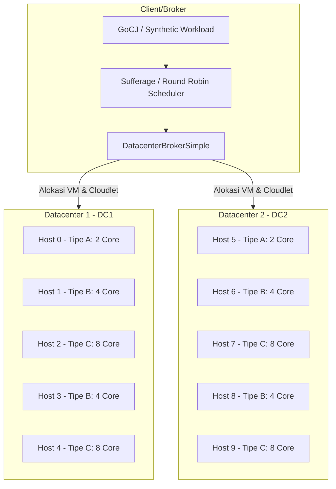

### Spesifikasi Infrastruktur

#### 1. Host Fisik (10 Host, 5 Host/Datacenter)
Urutan tipe host per datacenter: A, B, C, B, C.

| Tipe Host | Core (PE) | MIPS / Core | Total MIPS | RAM (MB) | Bandwidth | Storage | Kategori |
|:---|:---:|:---:|:---:|:---:|:---:|:---:|:---|
| **Tipe A** | 2 | 2.000 | 4.000 | 4.096 (4 GB) | 10.000 Mbps | 1.000.000 MB | Rendah |
| **Tipe B** | 4 | 3.000 | 12.000 | 8.192 (8 GB) | 10.000 Mbps | 1.000.000 MB | Sedang |
| **Tipe C** | 8 | 4.000 | 32.000 | 16.384 (16 GB) | 10.000 Mbps | 1.000.000 MB | Tinggi |

#### 2. Virtual Machine (20 VM, 10 VM/Datacenter)
| Profil VM | vCPU (PE) | MIPS | RAM (MB) | Bandwidth | Kebijakan Penjadwalan |
|:---|:---:|:---:|:---:|:---:|:---|
| **VM Kecil** | 1 | 1.800 | 1.024 (1 GB) | 1.000 Mbps | Space-Shared Cloudlet Scheduler |
| **VM Sedang** | 2 | 2.800 | 2.048 (2 GB) | 1.000 Mbps | Space-Shared Cloudlet Scheduler |
| **VM Besar** | 4 | 3.800 | 4.096 (4 GB) | 1.000 Mbps | Space-Shared Cloudlet Scheduler |

#### 3. Dataset Beban Kerja
Simulasi mendukung dua jenis workload:

- **GoCJ**: 10 ukuran dataset, yaitu 100, 200, 300, ..., 1000 cloudlet.
- **Sintetis**: 10 ukuran dataset, yaitu 1000, 2000, 3000, ..., 10000 task.

Dataset sintetis dibuat langsung di memori oleh `GoCJLoader.generateSynthetic()`.
Seed dibedakan untuk setiap pasangan ukuran dan run, sedangkan Sufferage dan
Round Robin memakai list task length yang sama pada run yang sama. Proporsi
kategori sintetis yang digunakan adalah Small 20%, Medium 40%, Large 30%,
Extra Large 4%, dan Huge 6%.

Kategori ukuran task yang digunakan:
- **Small Task**: 1.000 - 10.000 Million Instructions (MI)
- **Medium Task**: 10.000 - 50.000 MI
- **Large Task**: 50.000 - 100.000 MI
- **Extra Large Task**: 100.000 - 200.000 MI
- **Huge Task**: 200.000 - 300.000 MI

---

## 🧠 Cara Kerja Algoritma Sufferage

Sufferage adalah algoritma heuristik berbasis *completion time* yang didesain untuk mencegah penundaan task yang sangat bergantung pada mesin cepat.


---

## 📂 Struktur Direktori Proyek

```text
.
├── pom.xml                               # Konfigurasi dependensi Maven & Shade plugin
├── README.md
├── plot.py                               # Pembuat grafik dari hasil eksperimen
├── hasil.csv                             # Output mode --eksperimen (data mentah per run)
├── hasil_sintetis.csv                    # Output mode --sintetis (data mentah per run)
├── ringkasan_rata2.csv                   # Rata-rata & std per dataset x algoritma
├── grafik/                               # Grafik PNG (dibuat oleh plot.py)
├── src
│   └── main
│       ├── java
│       │   └── soka
│       │       ├── Kelompok7Simulation.java   # Main class: orkestrasi simulasi & mode eksperimen
│       │       ├── GoCJLoader.java           # Loader & generator sintetis dataset GoCJ
│       │       ├── MetricsCalculator.java    # Cetak ringkasan metrik (mode --demo2)
│       │       └── scheduler
│       │           ├── SufferageScheduler.java    # Algoritma Heuristik Sufferage
│       │           └── RoundRobinScheduler.java   # Baseline Scheduler pembanding
│       └── resources
│           └── Dataset_GoCJ/                 # GoCJ_Dataset_100.txt ... GoCJ_Dataset_1000.txt
└── target                                    # Hasil kompilasi (tidak di-commit)
```

## Pemetaan Proposal ke Kode

Bagian ini dapat dipakai saat demo untuk menunjukkan hubungan proposal dan implementasi (nomor baris tidak dicantumkan karena berubah seiring revisi).

| Bagian proposal | Implementasi |
|:---|:---|
| Dua datacenter | `Kelompok7Simulation.buatDatacenter()` dipanggil untuk `DC1` dan `DC2` di `jalankan()`. |
| Lima host per datacenter, total sepuluh host | Parameter `5` pada pemanggilan `buatDatacenter()`; host dibuat di dalam method tersebut. |
| Host heterogen tipe A/B/C | `Kelompok7Simulation.buatHost()` mengatur core, MIPS, RAM, bandwidth, dan storage. |
| Dua puluh VM, sepuluh VM per datacenter | Dua pemanggilan `buatVmHeterogen(10)` di `jalankan()`. VM 0-9 dipetakan ke DC1 dan VM 10-19 ke DC2 lewat `setDatacenterMapper`. |
| VM kecil, sedang, dan besar | `Kelompok7Simulation.buatVmHeterogen()` mengatur MIPS, PE, dan RAM untuk tiga tipe VM. |
| Dataset GoCJ 100 sampai 1000 cloudlet | Loop ukuran dataset di `eksperimenGoCJ()`; pembacaan file di `buatCloudlet()`. File ada di `src/main/resources/Dataset_GoCJ/`. |
| Dataset sintetis 1000 sampai 10000 task | Loop ukuran dan run di `eksperimenSintetis()`; nilai MI dibuat oleh `GoCJLoader.generateSynthetic()` dengan proporsi `PROPORSI`. |
| Task independent | Setiap baris dataset dibuat menjadi satu `CloudletSimple` tanpa dependency/DAG di `buatCloudlet()`. |
| Sufferage heuristic | `SufferageScheduler.schedule()` di `src/main/java/soka/scheduler/SufferageScheduler.java`. |
| Round Robin sebagai baseline | `RoundRobinScheduler.schedule()` di `src/main/java/soka/scheduler/RoundRobinScheduler.java`. |
| Broker menempatkan cloudlet ke VM | `broker.bindCloudletToVm()` di `jalankan()`. |
| Makespan, DI, RU, throughput, response time | `MetricsCalculator.cetakRingkasan()` (output konsol) dan `Kelompok7Simulation.hitungMetrik()` (output CSV), dengan rumus yang sama. |
| Semua cloudlet harus selesai | `jalankan()` melempar exception bila jumlah cloudlet selesai tidak sama dengan jumlah cloudlet yang disubmit. |
| Provisioning statis dan tanpa migrasi | Host dan VM dibuat sebelum simulasi dimulai; tidak ada autoscaling atau migrasi VM. |

### Batasan implementasi saat ini

- Prioritas atau deadline cloudlet belum dimodelkan. Scheduler hanya memakai panjang cloudlet, MIPS VM, PE, dan ready time.
- Bandwidth dan storage VM sama untuk semua VM; variasi hanya pada MIPS, PE, dan RAM.
- Yang diimplementasikan adalah Sufferage heuristic sebagai dasar pendekatan LBMM, bukan seluruh variasi LBMM.
- Sufferage dan Round Robin bersifat **deterministik**: untuk dataset yang sama, tiga kali run menghasilkan metrik kualitas yang identik (std = 0). Hanya `sched_ms` yang bervariasi.
- Dataset sintetis 1000 sampai 10000 task terintegrasi dengan seed berbeda per run.

---

## 🚀 Cara Menjalankan Simulasi

**Prasyarat**
- **JDK** 17+ (`java -version`)
- **Apache Maven** 3.8+ (`mvn -version`)
- **Python 3** dengan `pandas` dan `matplotlib` (hanya untuk grafik)

Di Kali/Debian:
```bash
sudo apt install -y default-jdk maven python3-pandas python3-matplotlib
```

### 1. Build
```bash
mvn clean package -DskipTests
```
Hasil build berupa fat JAR `target/soka-simulasi.jar`. Build ulang setiap kali kode berubah.

### 2. Mode demo2 (GoCJ 500 dan 1000, output detail)
```bash
java -jar target/soka-simulasi.jar --demo2
```
Mode ini menampilkan konfigurasi infrastruktur terlebih dahulu: 2 datacenter,
5 host per datacenter, tipe host rendah/sedang/tinggi, serta 20 VM dan
spesifikasinya. Setelah CloudSim melakukan provisioning, mode ini juga
menampilkan host aktual untuk setiap VM. Setelah itu simulasi GoCJ 500 dan
1000 dijalankan.

### 3. Mode eksperimen (GoCJ 100 sampai 1000, 3 run per konfigurasi)
```bash
java -jar target/soka-simulasi.jar --eksperimen
```
Menjalankan 10 dataset x 2 algoritma x 3 run (60 simulasi) dan menulis `hasil.csv` dengan kolom:
`dataset_type,size,algorithm,run,makespan,di,ru,throughput,art,sched_ms`

### 4. Mode eksperimen dataset sintetis (1000 sampai 10000 task)
```bash
java -jar target/soka-simulasi.jar --sintetis
```
Menjalankan ukuran 1000, 2000, ..., 10000 task, masing-masing 3 run untuk
Sufferage dan Round Robin, lalu menulis `hasil_sintetis.csv`. Seed dibedakan untuk
setiap pasangan `(ukuran, run)`, sedangkan kedua algoritma memakai dataset yang
sama pada run tersebut. Proporsi kategori task diatur pada konstanta `PROPORSI`
di `Kelompok7Simulation.java`.

### 5. Buat grafik
```bash
python3 plot.py
```
Perintah ini membaca `hasil.csv` dan `hasil_sintetis.csv` jika tersedia. Outputnya:

- `grafik/gocj_<metrik>.png` untuk GoCJ 100 sampai 1000 task.
- `grafik/sintetis_<metrik>.png` untuk sintetis 1000 sampai 10000 task.
- `ringkasan_rata2.csv`, berisi rata-rata dan standar deviasi setiap metrik per ukuran dataset dan algoritma.

Sumbu X adalah jumlah task, sumbu Y adalah metrik, garis dibedakan berdasarkan algoritma,
dan error bar adalah standar deviasi antar tiga run. Pada GoCJ, dataset yang sama diulang
sehingga metrik kualitas dapat memiliki standar deviasi nol; pada sintetis, setiap run
menggunakan dataset berbeda sehingga error bar menunjukkan variasi antar dataset.

Jalankan semua perintah dari root repo, karena dataset dibaca dari resource dan `hasil.csv` ditulis ke folder kerja saat ini.

---

## 📊 Hasil Simulasi

### Contoh output mode `--demo2` (GoCJ 500)

```text
=============== KONFIGURASI INFRASTRUKTUR ===============
CloudSim Plus: 2 datacenter, masing-masing 5 host
Total: 10 host dan 20 VM

Host per datacenter:
  DC1 (5 host):
    Host-00: rendah (2 core, 2.000 MIPS/core, 4.096 MB RAM)
    Host-01: sedang (4 core, 3.000 MIPS/core, 8.192 MB RAM)
    Host-02: tinggi (8 core, 4.000 MIPS/core, 16.384 MB RAM)

Alokasi VM ke host setelah provisioning:
  VM-00 -> DC1 / Host-00: rendah (2 core, 2.000 MIPS/core, 4.096 MB RAM)
  VM-01 -> DC1 / Host-01: sedang (4 core, 3.000 MIPS/core, 8.192 MB RAM)
  VM-02 -> DC1 / Host-02: tinggi (8 core, 4.000 MIPS/core, 16.384 MB RAM)

================ DATASET: GoCJ_Dataset_500.txt ================
Assignment Sufferage (LBMM) [GoCJ_Dataset_500.txt]:
  VM-00 (1800 MIPS, 1 PE): 13 task, 837,500 MI
  VM-01 (2800 MIPS, 2 PE): 19 task, 2,575,000 MI

>>> Menjalankan Sufferage (LBMM)
Cloudlet selesai: 500 dari 500

================ HASIL: Sufferage (LBMM) ================
Makespan               : 602.43 detik
Degree of Imbalance(DI): 1.4319
Resource Utilization   : 77.36%
Throughput             : 0.8300 task/detik
Avg. Response Time     : 250.70 detik
Jumlah VM aktif dipakai: 20
=================================================
```

### Perbandingan Sufferage vs Round Robin

| Dataset | Algoritma | Makespan (s) | DI | RU (%) | Throughput (task/s) | ART (s) |
|:--|:--|--:|--:|--:|--:|--:|
| GoCJ 500 | Sufferage | 602.43 | 1.4319 | 77.36 | 0.8300 | 250.70 |
| GoCJ 500 | Round Robin | 2005.45 | 1.0847 | 29.06 | 0.2493 | 460.94 |
| GoCJ 1000 | Sufferage | 1095.35 | 1.3944 | 85.10 | 0.9130 | 476.29 |
| GoCJ 1000 | Round Robin | 4608.44 | 1.1551 | 26.36 | 0.2170 | 948.09 |

Data lengkap GoCJ ada di `hasil.csv`; data sintetis ada di `hasil_sintetis.csv`.
Ringkasan gabungan kedua eksperimen ada di `ringkasan_rata2.csv`.

**Pengamatan**
- Sufferage menurunkan makespan sekitar 70% (500 task) dan 76% (1000 task) dibanding Round Robin, dengan RU naik dari kisaran 26-29% menjadi 77-85%.
- DI Sufferage lebih tinggi daripada Round Robin. Sufferage meminimalkan completion time sehingga beban menumpuk di VM cepat, sedangkan Round Robin membagi jumlah task rata tetapi lambat. Ini sejalan dengan trade-off yang dibahas pada proposal (bagian 3.3): algoritma yang hanya mengoptimasi makespan cenderung menghasilkan DI tinggi.
- RU yang lebih tinggi tidak otomatis berarti algoritma selalu lebih baik. RU harus dibaca bersama makespan, throughput, ART, dan DI. Pada hasil ini Sufferage lebih baik secara waktu dan throughput, dengan trade-off DI yang lebih tinggi.

### Grafik perbandingan (GoCJ 100 - 1000)

| Makespan | Degree of Imbalance |
|:--:|:--:|
| 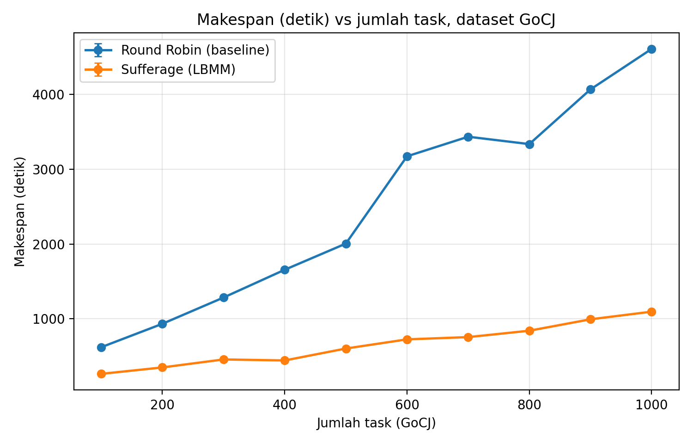 | 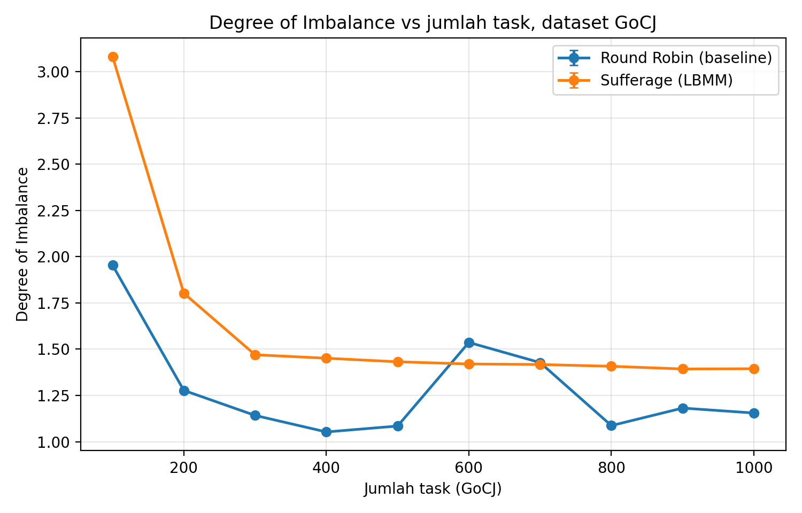 |

| Resource Utilization | Throughput |
|:--:|:--:|
| 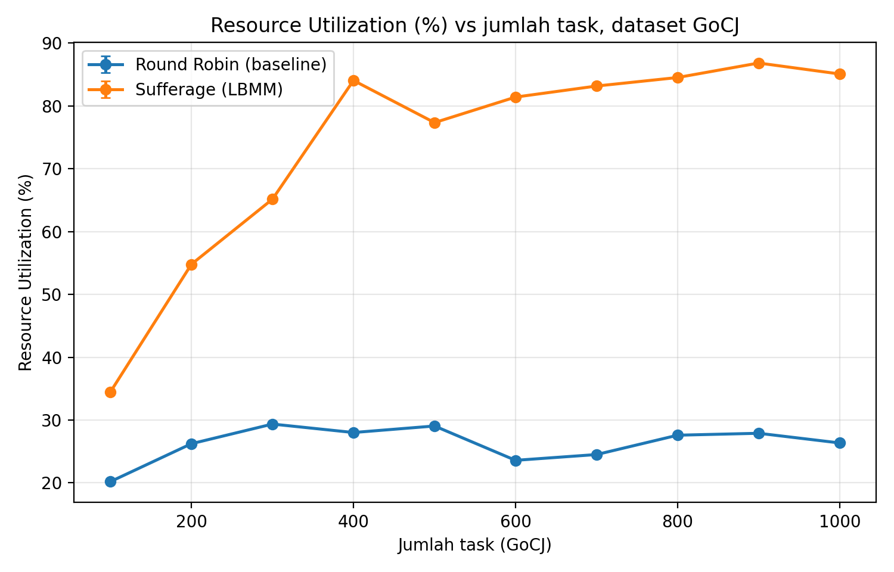 | 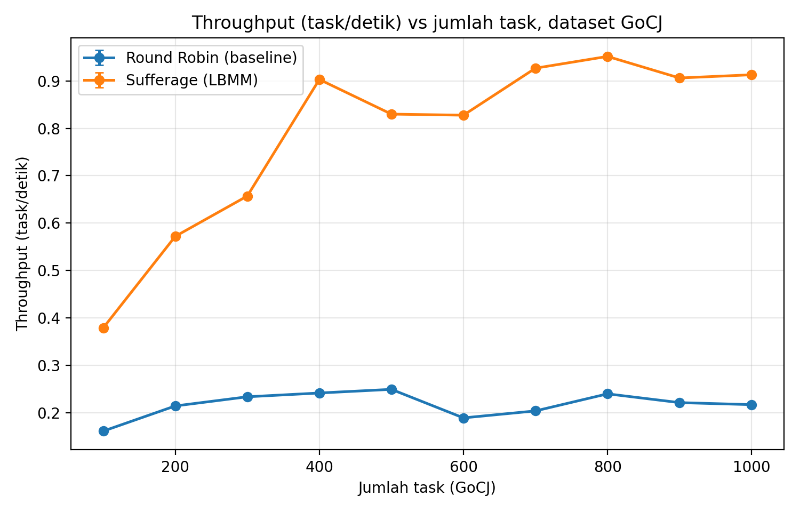 |

| Avg. Response Time | Waktu Scheduling |
|:--:|:--:|
| 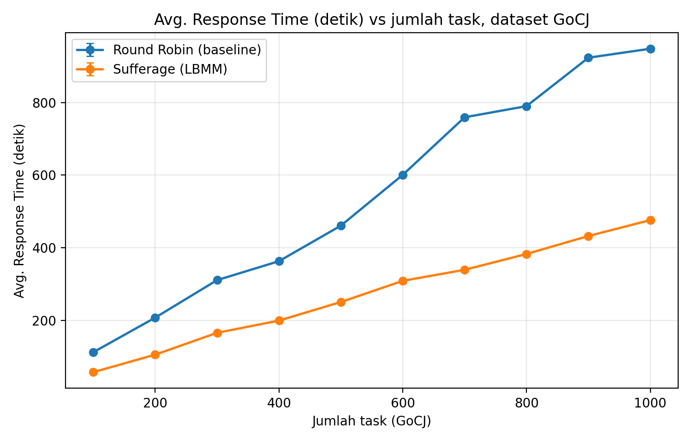 | 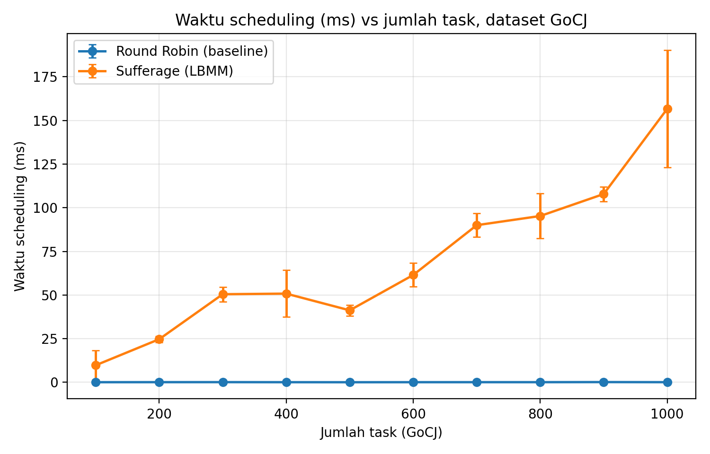 |

### Grafik perbandingan (dataset sintetis 1000 - 10000)

| Makespan | Degree of Imbalance |
|:--:|:--:|
| 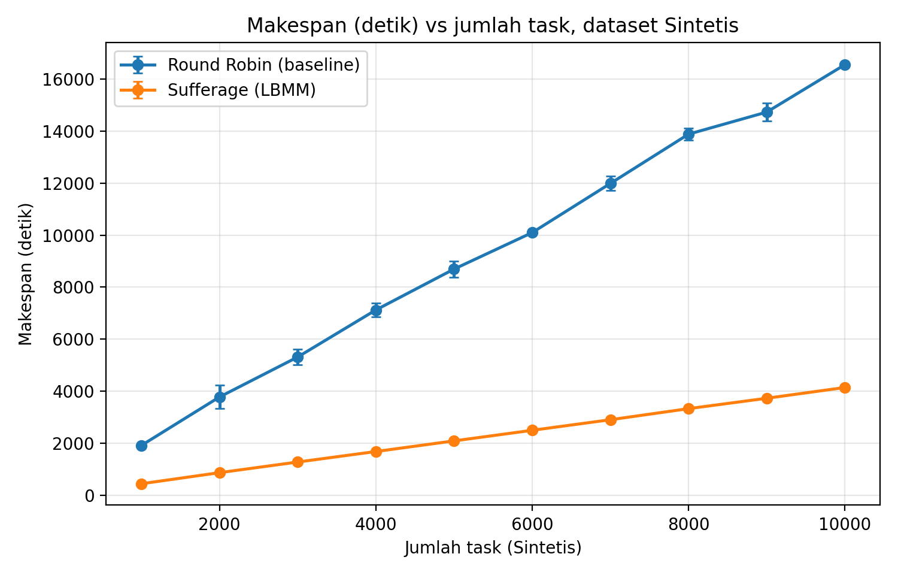 | 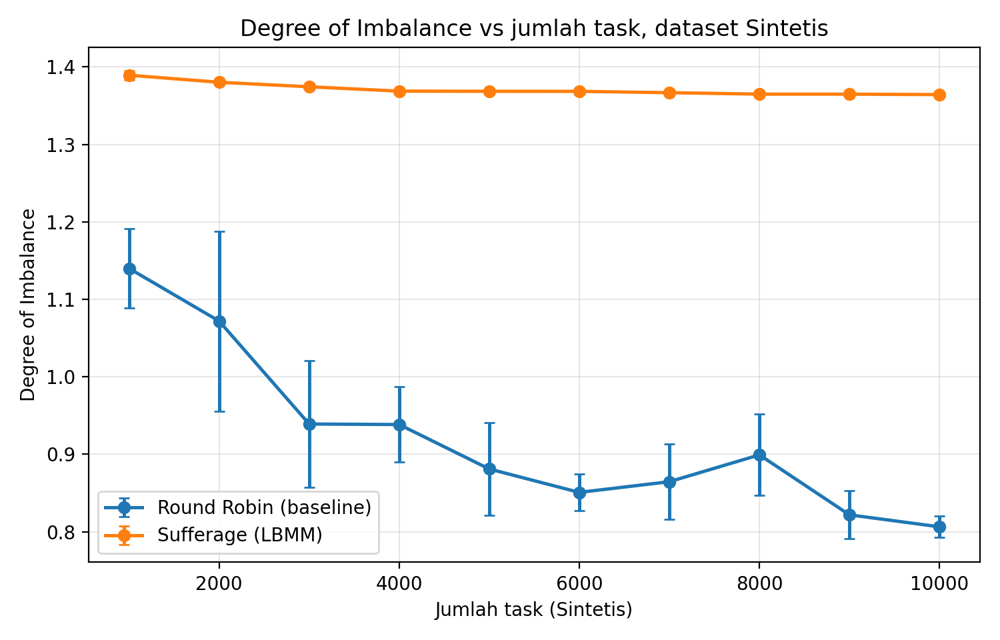 |

| Resource Utilization | Throughput |
|:--:|:--:|
| 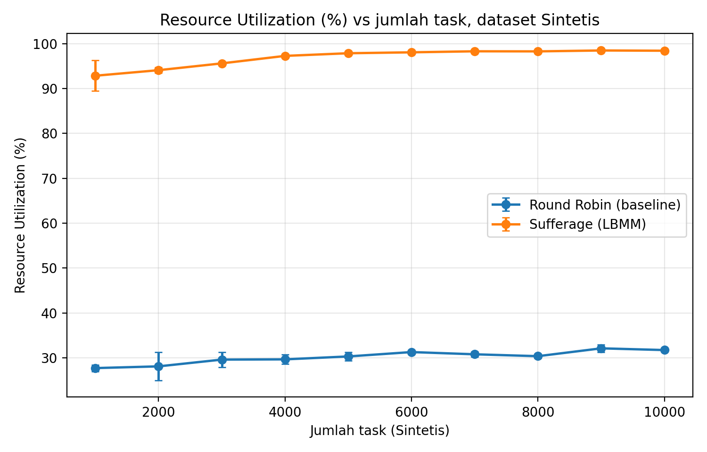 | 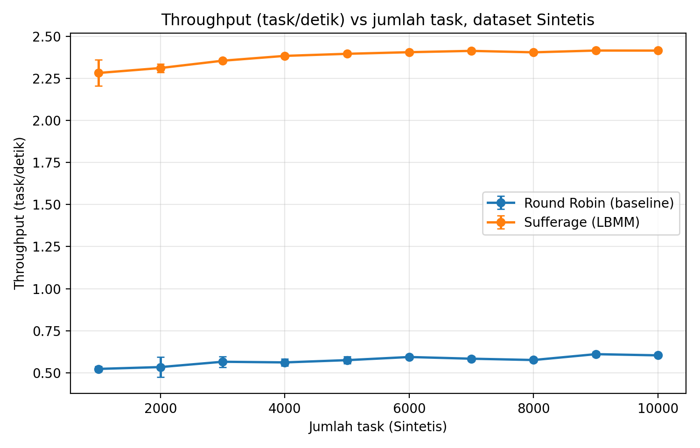 |

| Avg. Response Time | Waktu Scheduling |
|:--:|:--:|
| 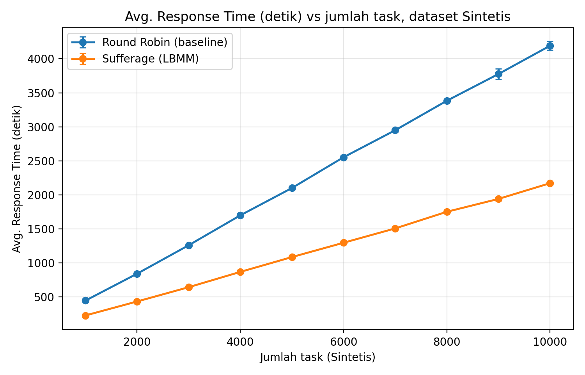 | 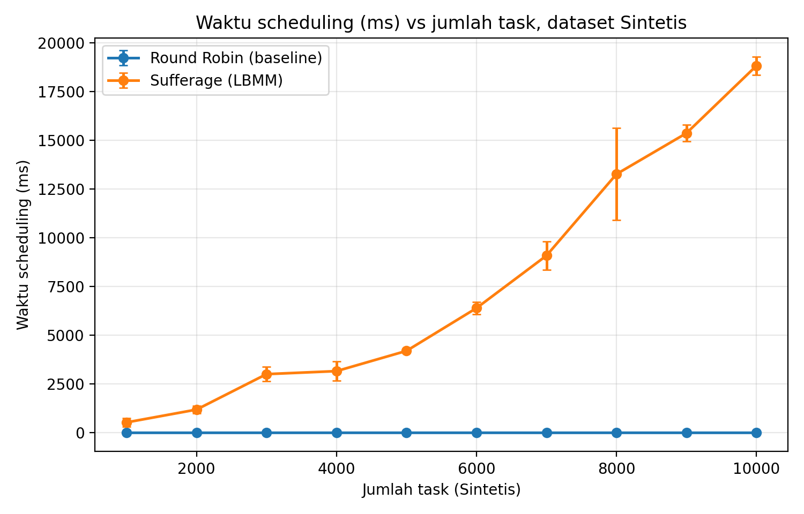 |

---

## 🔮 Roadmap Pengembangan Selanjutnya

- [x] **Baseline Scheduler**: *Round Robin* ([RoundRobinScheduler.java](src/main/java/soka/scheduler/RoundRobinScheduler.java)).
- [x] **Heuristic Scheduler**: *Sufferage (LBMM Foundation)* ([SufferageScheduler.java](src/main/java/soka/scheduler/SufferageScheduler.java)).
- [x] **Eksperimen GoCJ 100-1000**: 3 run per dataset, ekspor `hasil.csv`.
- [x] **Visualisasi**: grafik per metrik (X = jumlah task) lewat `plot.py`.
- [x] **Dataset sintetis 1000-10000 task** dengan proporsi kategori yang ditentukan sendiri, seed berbeda per run.
- [ ] **Metaheuristik Bio-Inspired**:
  - Cat Swarm Optimization (CSO)
  - Coati Optimization Algorithm (COA)
- [ ] **Algoritma Hybrid**:
  - Hybrid PSO + CSO untuk optimasi multi-objektif (Makespan, Energi, dan Cost).
- [ ] **Penyelarasan dokumen proposal**: definisi ART dan formula throughput.

---

## 📚 Referensi

1. **CloudSim Plus Framework**:
   Silva Filho, M. C., Oliveira, R. L., Monteiro, C. C., Inácio, P. R., & Freire, M. M. (2017). *CloudSim Plus: a modern Java 8 framework for modeling and simulation of cloud computing infrastructures*. Software: Practice and Experience, 47(9), 1309-1345.
2. **GoCJ Dataset**:
   Hussain, A., & Aleem, M. (2018). *GoCJ: Google Cloud Jobs Dataset for Distributed and Cloud Computing Infrastructures*. Data, 3(4), 38.
3. **Sufferage Scheduling in Heterogeneous Environments**:
   Maheswaran, M., Ali, S., Siegel, H. J., Hensgen, D., & Freund, R. F. (1999). *Dynamic matching and scheduling of a class of independent tasks onto heterogeneous computing systems*. Proceedings Eighth Heterogeneous Computing Workshop (HCW'99), 30-44.
4. **Load Balanced Min-Min (LBMM)**:
   Kokilavani, T., & Amalarethinam, D. I. G. (2011). *Load balanced min-min algorithm for static meta-task scheduling in grid computing*. International Journal of Computer Applications, 20(2), 43-49.