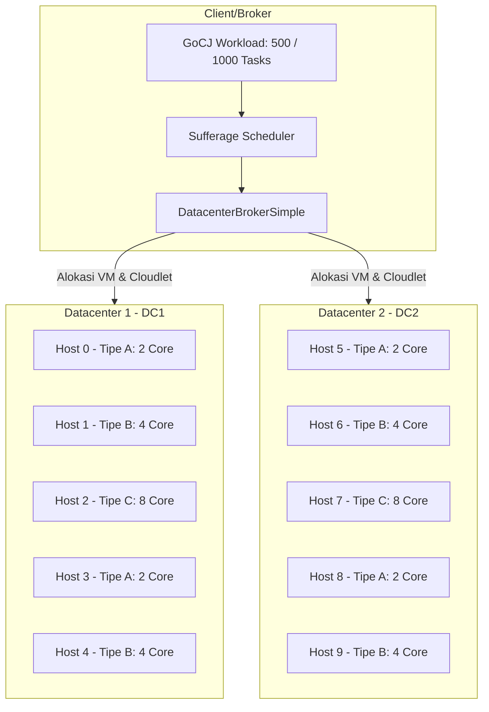
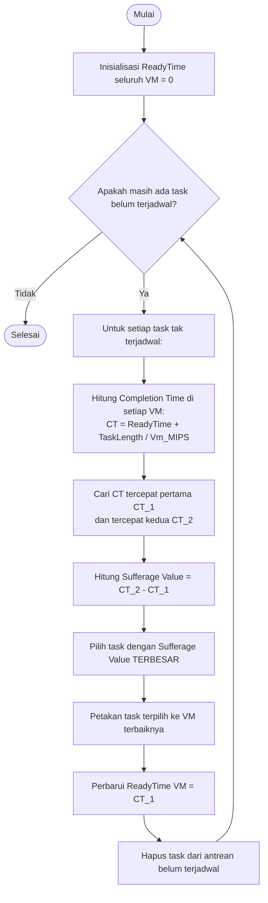

# Simulasi Cloud Task Scheduling Menggunakan Algoritma Heuristik Sufferage

[](https://www.oracle.com/java/)
[](https://maven.apache.org/)
[](https://cloudsimplus.org/)
[](#)

Implementasi optimasi task scheduling pada infrastruktur cloud computing (*multi-datacenter*) menggunakan **Algoritma Heuristik Sufferage** berbasis **CloudSim Plus**.

---

## 👥 Anggota Kelompok 7

| No | Nama Anggota | NRP |
|:--:|:---|:---|
| 1 | Imam Mahmud Dalil Fauzan | 5027241100 |
| 2 | Ahmad Yazid Arifuddin | 5027241040 |
| 3 | Christiano Ronaldo Silalahi | 5027241025 |
| 4 | Oscaryavat Viryavan | 5027241053 |
| 5 | Adiwidya Budi Pratama | 5027241012 |

---

## 📌 Ringkasan Proyek

Task scheduling merupakan salah satu tantangan pada lingkungan cloud computing. Kompleksitas bertambah ketika infrastruktur terdistribusi dan beragam, di mana setiap node komputasi punya kapasitas CPU (MIPS), core, memori, dan bandwidth yang beda-beda.

Algoritma konvensional seperti Round Robin atau First-Come First-Served rentan menyebabkan:
1. **Makespan yang tinggi**: Waktu penyelesaian keseluruhan menjadi lama karena tugas besar dialokasikan ke kemampuan mesin dengan kapasitas rendah.
2. **Ketidakseimbangan beban (Imbalance)**: Sebagian mesin mengalami *overload*, sedangkan mesin lain menganggur (*idle*).

Di proyek ini, diimplementasikan algoritma **Sufferage Heuristic** (yang menjadi pondasi pendekatan *Load Balanced Min-Min / LBMM*). Algoritma ini memprioritaskan tasks berdasarkan nilai *sufferage* (selisih waktu penyelesaian terbaik pertama dan kedua) untuk meminimalkan *Makespan* sekaligus menjaga resource.

---

## 🎯 Objektif & Metrik Evaluasi

Simulasi ini mengukur efektivitas penjadwalan berdasarkan 5 metrik utama:

### 1. Makespan
Total waktu yang dibutuhkan untuk menyelesaikan seluruh cloudlet dalam simulasi.
Semakin kecil nilai makespan, semakin baik kinerjanya.
$$\text{Makespan} = \max_{j \in \text{Cloudlets}} (FT_j)$$
Di mana *FTj* adalah waktu selesai (*finish time*) dari cloudlet $j$.

### 2. Degree of Imbalance (DI)
Tingkat ketidakseimbangan load kerja antar VM. Semakin kecil nilai DI, semakin merata distribusi beban kerja antar VM.
$$DI = \frac{T_{max} - T_{min}}{T_{avg}}$$
Di mana *Tmax*, *Tmin*, dan *Tavg* berturut-turut adalah beban waktu eksekusi VM maksimum, minimum, dan rata-rata.

### 3. Resource Utilization (RU)
Persentase rata-rata pemanfaatan kemampuan komputasi VM.
Semakin tinggi nilai RU, semakin baik pemanfaatan sumber daya.
$$RU = \frac{\sum_i \text{BebanWaktuCPU}_i}{\left(\sum_i \text{PE}_i\right) \times \text{Makespan}} \times 100\%$$
Di mana `BebanWaktuCPU` adalah total durasi eksekusi cloudlet pada VM dan `PE` adalah jumlah core virtual VM. Penyebut menggunakan total PE karena satu VM dapat menjalankan beberapa cloudlet secara paralel pada beberapa PE.

### 4. Throughput
Jumlah tugas yang berhasil diselesaikan per detik.
Semakin tinggi nilai throughput, semakin baik kinerja algoritma penjadwalan.
$$\text{Throughput} = \frac{N}{\text{Makespan}}$$
Di mana *N* adalah total cloudlet yang diselesaikan.

### 5. Average Response Time
Rata-rata waktu yang dibutuhkan untuk menyelesaikan tugas sejak submission hingga selesai.
Semakin kecil nilai ART, semakin baik kinerja algoritma penjadwalan.
$$\text{ART} = \frac{1}{N} \sum_{j=1}^{N} (FT_j - ST_j)$$
Di mana *STj* adalah waktu mulai (*start time*) dari cloudlet $j$.

---

## 🏗️ Arsitektur Simulasi

Simulasi merepresentasikan lingkungan *multi-cloud datacenter*:



### Spesifikasi Infrastruktur

#### 1. Host Fisik (10 Host, 5 Host/Datacenter)
| Tipe Host | Core (PE) | MIPS / Core | Total MIPS | RAM (MB) | Bandwidth | Storage | Kategori |
|:---|:---:|:---:|:---:|:---:|:---:|:---:|:---|
| **Tipe A** | 2 | 2.000 | 4.000 | 4.096 (4 GB) | 10.000 Mbps | 1.000.000 MB | Rendah |
| **Tipe B** | 4 | 3.000 | 12.000 | 8.192 (8 GB) | 10.000 Mbps | 1.000.000 MB | Sedang |
| **Tipe C** | 8 | 4.000 | 32.000 | 16.384 (16 GB) | 10.000 Mbps | 1.000.000 MB | Tinggi |

#### 2. Virtual Machine (20 VM, 10 VM/Datacenter)
| Profil VM | vCPU (PE) | MIPS | RAM (MB) | Bandwidth | Kebijakan Penjadwalan |
|:---|:---:|:---:|:---:|:---:|:---|
| **VM Kecil** | 1 | 1.800 | 1.024 (1 GB) | 1.000 Mbps | Space-Shared Cloudlet Scheduler |
| **VM Sedang** | 2 | 2.800 | 2.048 (2 GB) | 1.000 Mbps | Space-Shared Cloudlet Scheduler |
| **VM Besar** | 4 | 3.800 | 4.096 (4 GB) | 1.000 Mbps | Space-Shared Cloudlet Scheduler |

#### 3. Dataset Beban Kerja (Google Cloud Jobs - GoCJ)
Simulasi menggunakan dataset asli **GoCJ (Google Cloud Jobs)**. Pengujian dilakukan pada 500 dan 1000 cloudlet:
- **Small Task**: $1.000 - 10.000$ Million Instructions (MI)
- **Medium Task**: $10.000 - 50.000$ MI
- **Large Task**: $50.000 - 100.000$ MI
- **Extra Large Task**: $100.000 - 200.000$ MI
- **Huge Task**: $200.000 - 300.000$ MI

---

## 🧠 Cara Kerja Algoritma Sufferage

Algoritma Sufferage merupakan algoritma heuristik berbasis *completion time* yang didesain untuk mencegah penundaan tugas yang memiliki ketergantungan tinggi pada mesin cepat.



---

## 📂 Struktur Direktori Proyek

```text
.
├── pom.xml                               # Konfigurasi dependensi Maven & Shade plugin
├── README.md
├── src
│   └── main
│       ├── java
│       │   └── soka
│       │       ├── Kelompok7Simulation.java   # Main Class orkestrasi simulasi CloudSim Plus
│       │       ├── GoCJLoader.java           # Loader & Synthetic Generator dataset GoCJ
│       │       ├── MetricsCalculator.java    # Kalkulator metrik performa (Makespan, DI, RU)
│       │       └── scheduler
│       │           ├── SufferageScheduler.java    # Implementasi Algoritma Heuristik Sufferage
│       │           └── RoundRobinScheduler.java   # Baseline Scheduler pembanding
│       └── resources
│           └── Dataset_GoCJ/                 # File dataset GoCJ asli
└── target                                    # Direktori hasil kompilasi binary & JAR
```

## Pemetaan Proposal ke Kode

Bagian ini dapat digunakan saat demo untuk menunjukkan hubungan antara isi proposal dan implementasi.

| Bagian proposal | Implementasi |
|:---|:---|
| Dua datacenter | `Kelompok7Simulation.buatDatacenter()` dipanggil untuk `DC1` dan `DC2` pada `src/main/java/soka/Kelompok7Simulation.java` baris 49-50. |
| Lima host per datacenter, total sepuluh host | Parameter `5` pada baris 49-50, lalu host dibuat di method `buatDatacenter()` baris 124-137. |
| Host heterogen tipe A/B/C | Method `buatHost()` pada baris 140-148 mengatur core, MIPS, RAM, bandwidth, dan storage. |
| Dua puluh VM, sepuluh VM per datacenter | Dua pemanggilan `buatVmHeterogen(10)` pada baris 55-57. Pemetaan VM 0-9 ke DC1 dan VM 10-19 ke DC2 dilakukan pada baris 51-53. |
| VM kecil, sedang, dan besar | Method `buatVmHeterogen()` pada baris 151-164 mengatur MIPS, PE, dan RAM berdasarkan tiga tipe VM. |
| Dataset GoCJ 500 dan 1000 cloudlet | Daftar dataset pada baris 40-43 dan pembacaan resource pada baris 98-118. File datanya berada di `src/main/resources/Dataset_GoCJ/`. |
| Task independent | Setiap baris dataset dibuat menjadi satu `CloudletSimple` tanpa dependency atau DAG pada baris 107-116. |
| Sufferage heuristic | `SufferageScheduler.schedule()` pada `src/main/java/soka/scheduler/SufferageScheduler.java` baris 36-101. Completion time dihitung pada baris 61-77, sufferage pada baris 80-81, dan task dipetakan pada baris 91-98. |
| Round Robin sebagai baseline | `RoundRobinScheduler.schedule()` pada `src/main/java/soka/scheduler/RoundRobinScheduler.java` baris 19-27. |
| Broker menempatkan cloudlet ke VM | Binding dilakukan dengan `broker.bindCloudletToVm()` pada `Kelompok7Simulation.java` baris 67-68. |
| Makespan, DI, RU, throughput, dan response time | Semua metrik dihitung di `src/main/java/soka/MetricsCalculator.java` baris 23-75. RU memakai total waktu CPU dibagi total kapasitas PE selama makespan. |
| Semua cloudlet harus selesai | Ukuran hasil scheduler divalidasi pada baris 62-65 dan jumlah cloudlet selesai dicetak pada baris 72-74. |
| Provisioning statis dan tanpa migrasi | Host dan VM dibuat sebelum simulasi dimulai; tidak ada kode autoscaling atau migrasi VM. |

### Batasan implementasi saat ini

- Prioritas atau deadline cloudlet belum dimodelkan. Scheduler hanya menggunakan panjang cloudlet, MIPS VM, PE, dan ready time.
- Bandwidth dan storage VM saat ini sama untuk semua VM; variasi utama ada pada MIPS, PE, dan RAM.
- Implementasi yang digunakan adalah Sufferage heuristic sebagai dasar pendekatan LBMM, bukan seluruh variasi LBMM.
- Dataset dibaca dari file resource di repository. Generator sintetis masih tersedia di `GoCJLoader`, tetapi tidak dipanggil oleh `Kelompok7Simulation`.

---

## 🚀 Cara Menjalankan Simulasi

- **Java Development Kit (JDK)**: Versi 17+ (`java -version`).
- **Apache Maven**: Versi 3.8+ (`mvn -version`) atau gunakan Maven Wrapper (`mvnw`).

### Run via Terminal / CLI

1. **Compile**
   ```bash
   mvn clean package
   ```

2. **Jalankan Simulasi:**
   ```bash
   java -jar target/soka-simulasi.jar
   ```
---

## 📊 Hasil Output Simulasi

```text
================ DATASET: GoCJ_Dataset_500.txt ================
>>> Menjalankan Sufferage (LBMM)
Cloudlet selesai: 500 dari 500

================ HASIL: Sufferage (LBMM) ================
Makespan               : 602.43 detik
Degree of Imbalance(DI): 1.4319
Resource Utilization   : 77.36%
Throughput             : 0.8300 task/detik
Avg. Response Time     : 250.70 detik
Jumlah VM aktif dipakai: 20
=================================================
```

---

## 🔮 Roadmap Pengembangan Selanjutnya

- [x] **Implementasi Baseline Scheduler**: *Round Robin* ([RoundRobinScheduler.java](file:///src/main/java/soka/scheduler/RoundRobinScheduler.java)).
- [x] **Implementasi Heuristic Scheduler**: *Sufferage (LBMM Foundation)* ([SufferageScheduler.java](file:///src/main/java/soka/scheduler/SufferageScheduler.java)).
- [ ] **Implementasi Metaheuristik Bio-Inspired**:
  - **Cat Swarm Optimization (CSO)**
  - **Coati Optimization Algorithm (COA)**
- [ ] **Implementasi Algoritma Hybrid**:
  - **Hybrid PSO + CSO** untuk optimasi multi-objektif (Makespan, Energi, dan Cost).
- [ ] **Visualisasi & Analisis Komparatif**: Ekspor log ke format CSV/Excel dan pembuatan grafik perbandingan performa antar algoritma.

---

## 📚 Referensi

1. **CloudSim Plus Framework**:  
   Silva Filho, M. C., Oliveira, R. L., Monteiro, C. C., Inácio, P. R., & Freire, M. M. (2017). *CloudSim Plus: a modern Java 8 framework for modeling and simulation of cloud computing infrastructures*. Software: Practice and Experience, 47(9), 1309-1345.
2. **GoCJ Dataset**:  
   Ghafari, R., & Mansouri, N. (2020). *GoCJ: A Google cloud jobs dataset for cloud computing simulation*. Mendeley Data, V1.
3. **Sufferage Scheduling in Heterogeneous Environments**:  
   Maheswaran, M., Ali, S., Siegel, H. J., Hensgen, D., & Freund, R. F. (1999). *Dynamic matching and scheduling of a class of independent tasks onto heterogeneous computing systems*. Proceedings Eighth Heterogeneous Computing Workshop (HCW'99), 30-44.
4. **Load Balanced Min-Min (LBMM)**:  
   Kokilavani, T., & Amalarethinam, D. I. G. (2011). *Load balanced min-min algorithm for static meta-task scheduling in grid computing*. International Journal of Computer Applications, 20(2), 43-49.
